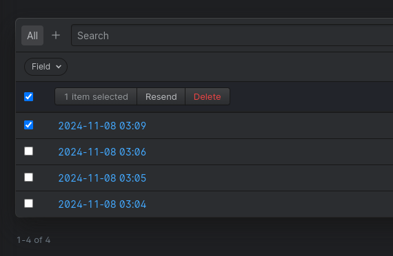

# Statamic Resend Form Submissions Addon



This Statamic addon, developed by Varsuite Media Group Limited, provides an easy way to resend form submissions directly from the Statamic control panel.
The `ResendFormSubmissions` action allows you to resend submission data to the form's email recipients, with the option to override the original email address.

## Features

- Resend one or multiple form submissions with a single click.
- Optional override for the recipient email address.
- Confirmation dialog before resending submissions.
- Compatible with Statamic’s native form email system.

## Installation

To install the addon, you can use Composer:

```bash
composer require varsuite/statamic-resend-form-submissions
```

After installing, the addon will automatically be available within Statamic's control panel.

## Usage

1. Go to the Form Submissions section in the Statamic control panel.
2. Select one or multiple submissions you wish to resend.
3. In the action dropdown, choose the `Resend` option.
4. (Optional) Enter an email address in the override field if you want to change the recipient.
5. Confirm the resend action in the confirmation dialog.

## Configuration

This addon uses the default email settings configured for each form in Statamic. To override the email address for individual submissions, simply fill in the email override field when resending.

## Code Overview

The `ResendFormSubmissions` action class handles the resend functionality:

- **Fields**: `overwrite` (HTML description) and `email` (validated text input for email override).
- **run() Method**: Loops over selected submissions, applying an email override if provided, then dispatches each submission for resending.
- **Confirmation Text**: Provides a customizable confirmation message.
- **Visibility**: Only visible to users if the submission has an associated email configuration.

---

Feel free to customize further based on your specific use case or requirements!
